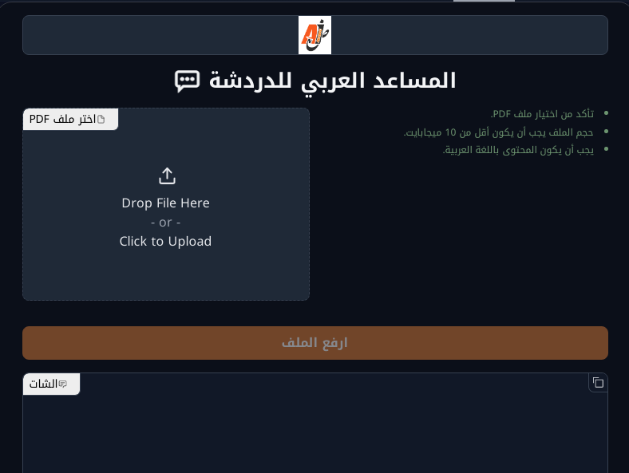

# Arabic Chat with PDF 📚💬  
[](LICENSE)  
[](https://www.python.org/)  
[](https://huggingface.co/spaces/MohammedNasser/Arabic-PDF-Chat)

## About 📖  
**Arabic Chat with PDF** is an innovative tool designed to enable users to interactively query Arabic PDF documents. Powered by state-of-the-art language models and document processing libraries, this application extracts, processes, and retrieves meaningful insights from Arabic text documents. Users can ask questions in Arabic, and the system responds in a professional tone, making this an essential tool for Arabic language researchers, educators, and professionals.  

---

## Live Demo 🚀  
Explore the hosted version of this project on Hugging Face Spaces:  

👉 [](https://huggingface.co/spaces/MohammedNasser/Arabic-PDF-Chat)  



Upload an Arabic PDF and start chatting in seconds! 💬📚  

---

## Features ✨  
- **Seamless PDF Integration**: Upload Arabic PDFs under 10 MB, and start chatting.  
- **Advanced Text Recognition**: Utilizes OCR for Arabic text extraction from searchable PDFs.  
- **Conversational Interface**: Interact via a chatbot with RTL (Right-To-Left) support for natural Arabic conversation.  
- **Multilingual Embeddings**: Employs multilingual embeddings for precise text analysis.  
- **Text-to-Speech**: Outputs audio responses in Arabic for accessibility.  
- **Customizable UI**: Designed with Arabic aesthetics and user-friendly components.  

---

## Technologies Used 🛠️  
- **Python Libraries**:  
  - [Gradio](https://gradio.app/): User-friendly UI for interaction.  
  - [PyPDF2](https://pypi.org/project/PyPDF2/): PDF text extraction.  
  - [pytesseract](https://github.com/tesseract-ocr/tesseract): OCR for PDFs.  
  - [LangChain](https://github.com/hwchase17/langchain): Framework for conversational AI with retrieval-based querying.  
  - [gTTS](https://github.com/pndurette/gTTS): Arabic text-to-speech functionality.  
- **Machine Learning Models**:  
  - **LLMs**: Powered by [ChatGroq](https://www.groq.com/) using the `gemma2-9b-it` model.  
  - **Embeddings**: Utilizes [sentence-transformers/paraphrase-multilingual-mpnet-base-v2](https://huggingface.co/sentence-transformers).  
- **Vector Store**: FAISS for efficient similarity search and retrieval.  

---

## Getting Started 🚀  

### Prerequisites 📋  
Ensure you have:  
- Python 3.9+  
- `pip` for package management  
- Access to API keys:  
  - `GROQ_API_KEY`  
  - `HF_TOKEN`  

### Installation ⚙️  
1. **Clone the Repository**:  
   ```bash
   git clone https://github.com/your-repo/arabicPdfChat.git
   cd arabic-chat-with-pdf
   ```  
2. **Install Dependencies**:  
   ```bash
   pip install -r requirements.txt
   ```  
3. **Set Up Environment Variables**:  
   Create a `.env` file and add the required API keys:  
   ```env
   GROQ_API_KEY=your_groq_api_key
   HF_TOKEN=your_huggingface_token
   ```  

### Run the Application 🖥️  
Launch the app with:  
```bash
python app.py
```  
The Gradio interface will open in your browser.  

---

## ETL Process 🔄  
The system follows a structured **ETL pipeline**:  
1. **Extract**: Reads Arabic PDFs using OCR (`pytesseract`) and `PyPDF2`.  
2. **Transform**:  
   - Splits text into manageable chunks with `CharacterTextSplitter`.  
   - Converts raw text into vector embeddings using `sentence-transformers`.  
3. **Load**: Stores transformed data in a FAISS vector database for efficient retrieval.  

---

## Limitations ⚠️  
- **File Size**: Limited to PDFs under 10 MB.  
- **Language Support**: Optimized only for Arabic text. Non-Arabic content is not supported.  
- **Scanned Documents**: OCR may struggle with low-quality scans.  
- **Performance**: Response times may vary depending on document size and complexity.  

---

## Author 🖋️  
👤 **M. N. Gaber**  
🔗 [GitHub Profile](https://github.com/MohammedNasserAhmed)  
🔗 [LinkedIn](https://linkedin.com/in/m-n-g)  

---

## License 📄  
This project is licensed under the [Apache License](LICENSE).  

---

## Acknowledgments 🙏  
Special thanks to the developers of the libraries and frameworks that made this project possible.  

---

## Contributing 🤝  
Contributions are welcome! Please fork the repository and submit a pull request. For major changes, open an issue first to discuss what you would like to change.  

---

## Future Plans 🛠️  
- Add support for scanned and handwriting docs.  
- Improve OCR accuracy for complex layouts.  
- Enhance conversational capabilities with additional LLM models.  

---

Enjoy exploring Arabic text in a whole new way! 🎉  
```
